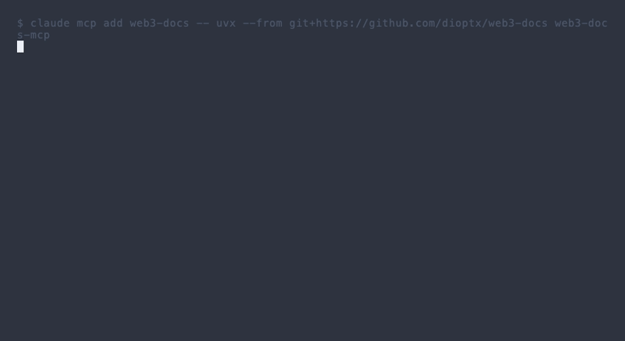
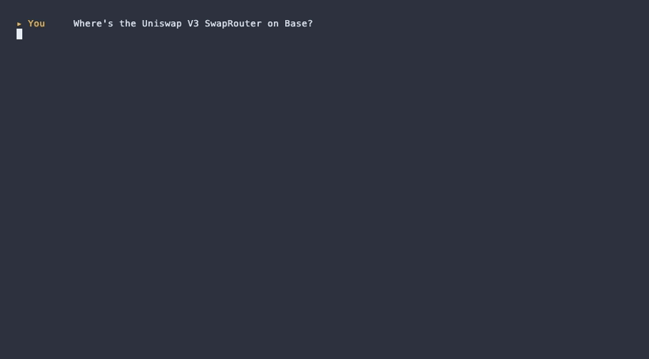

<div align="center">

# web3-docs

**One MCP server, eleven protocol-spec repos.**
Ask your coding agent about EIPs, BIPs, ADRs, CIPs, RFCs and canonical contract addresses — without ever leaving your editor. Works with any [MCP](https://modelcontextprotocol.io/)-compatible client: Claude Code, Cursor, Windsurf, Cline, Zed, Continue, OpenCode, Codex, and more.

[](LICENSE)
[](https://www.python.org/downloads/)
[](https://modelcontextprotocol.io/)
[](https://github.com/dioptx/web3-docs/actions/workflows/ci.yml)



<sub>Or replay in your own terminal: <code>asciinema play <a href="docs/assets/demo.cast">docs/assets/demo.cast</a></code></sub>

</div>

## Why

Specs for blockchain protocols live across **eleven different upstream repos** on three different forges. Every time you need to look up EIP-4844, BIP-340, CIP-25, or which fork shipped `PUSH0`, you're tab-hunting through GitHub. This MCP indexes them all locally with FTS5 ranking — **1,780+ proposals across 10 chains** plus addresses for 19 protocols on Ethereum, Arbitrum, Base, Optimism, Polygon, and more — so your agent answers with the *actual spec text*, not a hallucinated paraphrase.

## Install

> **Requires:** Python 3.11+ · [`uv`](https://docs.astral.sh/uv/) (provides `uvx`) · ~500 MB free disk for the index · `git` on PATH (used by `--sync`).

### Step 1 — build the index (one-time, ~2 min, ~500 MB in `~/.cache/web3-docs-mcp/`)

```bash
uvx --from git+https://github.com/dioptx/web3-docs web3-docs-mcp --sync
```

### Step 2 — register the server with your agent

The launch command is identical across clients:

```text
uvx --from git+https://github.com/dioptx/web3-docs web3-docs-mcp
```

<details><summary><b>Claude Code</b></summary>

```bash
claude mcp add web3-docs -- uvx --from git+https://github.com/dioptx/web3-docs web3-docs-mcp
```

</details>

<details><summary><b>Cursor · Windsurf · Cline · Continue · Zed · generic stdio MCP client</b></summary>

Add to the client's MCP config (`~/.cursor/mcp.json`, `~/.codeium/windsurf/mcp_config.json`, `cline_mcp_settings.json`, the `mcpServers` block in your Zed `settings.json`, etc.):

```json
{
  "mcpServers": {
    "web3-docs": {
      "command": "uvx",
      "args": ["--from", "git+https://github.com/dioptx/web3-docs", "web3-docs-mcp"]
    }
  }
}
```

</details>

<details><summary><b>OpenAI Codex CLI</b></summary>

```bash
codex mcp add web3-docs -- uvx --from git+https://github.com/dioptx/web3-docs web3-docs-mcp
```

</details>

<details><summary><b>From source (development)</b></summary>

```bash
git clone https://github.com/dioptx/web3-docs.git && cd web3-docs
uv sync
uv run python server.py --sync   # build index
uv run python server.py          # run stdio server
```

</details>

Restart your agent, then try **"Use web3-docs to look up EIP-1559."**

## What you can ask

| Ask your agent… | Tool chain |
|---|---|
| "What's the fee market in EIP-4844?" | `resolve_proposal` → `query_protocol_docs(query="fee")` |
| "Show me Cosmos ADR-001." | `resolve_proposal` → `query_protocol_docs` |
| "What's in Cancun?" | `list_fork_proposals("Cancun")` |
| "Which BIPs activated with Taproot?" | `list_fork_proposals("Taproot")` |
| "Uniswap router on Base?" | `resolve_contract(protocol="uniswap", chain_id="8453")` |
| "Cardano CIP for native tokens?" | `resolve_proposal("native tokens", chain="cardano")` → cip-25 |
| "ERC-4337 EntryPoint address on Arbitrum?" | `resolve_contract("erc4337", "42161")` |
| "Staking on Cosmos vs Polkadot?" | `resolve_proposal("staking", chain="cosmos")` then `chain="polkadot"` |

<div align="center">



<sub>Multi-chain canonical addresses, no etherscan tabs.</sub>

</div>

## Tools

| Tool | What it does |
|---|---|
| `resolve_proposal(query, chain?)` | Fuzzy-find a proposal by keyword, fork name, opcode, or ID. Returns top-5 ranked hits with chain/status/fork. Pass `chain=` (`ethereum`, `bitcoin`, `cosmos`, …) to disambiguate when keywords match multiple chains. |
| `query_protocol_docs(proposal_id, query?)` | Read the full spec body. With `query`, returns only the most relevant sections (token-budgeted). Includes metadata header (status, fork, activation date, authors). |
| `list_fork_proposals(fork_name)` | List every proposal activated by a named fork. Answers "what's in Cancun?" / "BIPs activated with Taproot?". Handles aliases (Pectra → Prague, Dencun → Cancun, Shapella → Shanghai, The Merge → Paris). |
| `resolve_contract(protocol, chain_id?)` | Look up canonical deployed addresses. 19 protocols × major EVM chains. Omit `chain_id` for all chains. |

<div align="center">


<sub>Fork → all proposals it shipped, then drill into one. Two tool calls instead of an afternoon of tab-hunting.</sub>

</div>

## Sources

11 upstream repos, all synced via `--sync`:

| Chain | Source |
|---|---|
| Ethereum (EIPs) | [`ethereum/EIPs`](https://github.com/ethereum/EIPs) |
| Ethereum (ERCs) | [`ethereum/ERCs`](https://github.com/ethereum/ERCs) |
| Bitcoin | [`bitcoin/bips`](https://github.com/bitcoin/bips) |
| Solana | [`solana-foundation/solana-improvement-documents`](https://github.com/solana-foundation/solana-improvement-documents) |
| Cosmos | [`cosmos/cosmos-sdk`](https://github.com/cosmos/cosmos-sdk) (`docs/architecture`) |
| Polkadot | [`polkadot-fellows/RFCs`](https://github.com/polkadot-fellows/RFCs) |
| Stacks | [`stacksgov/sips`](https://github.com/stacksgov/sips) |
| Avalanche | [`avalanche-foundation/ACPs`](https://github.com/avalanche-foundation/ACPs) |
| Cardano | [`cardano-foundation/CIPs`](https://github.com/cardano-foundation/CIPs) |
| Tezos | [`tezos/tzip`](https://gitlab.com/tezos/tzip) |
| Sui | [`sui-foundation/sips`](https://github.com/sui-foundation/sips) |

Fork mappings come from [`ethereum/execution-specs`](https://github.com/ethereum/execution-specs) plus canonical Bitcoin soft-fork activations (P2SH, SegWit, Taproot, …).

Contract registry covers: `aave`, `across`, `chainlink`, `compound`, `create2_deployer`, `curve`, `ens`, `erc4337`, `gnosis_safe`, `lido`, `maker`, `multicall`, `oneinch`, `permit2`, `seaport`, `uniswap`, `usdc`, `usdt`, `weth`.

## Why not …

**…just `gh search` or WebFetch each spec on demand?** You'd burn tokens on HTML markup and pay a network round-trip per query. `web3-docs` indexes everything once into local SQLite + FTS5 — sub-millisecond ranked search, plain-text bodies, no rate limits, works offline.

**…one MCP per chain?** You'd manage eleven separate servers and your agent wouldn't know which to call. One unified tool with a single `resolve_proposal` entry point lets the model find the right doc by *concept* (e.g. "blob transactions" → `eip-4844`) rather than guessing the source.

**…ask the model directly without an MCP?** Models hallucinate spec details — wrong fork, wrong gas costs, wrong opcode numbers. This server returns the *actual* upstream text with metadata (status, fork, activation date) so the agent can quote it verbatim.

**…use a vector DB?** Spec corpora are small (≈ 1.7K docs), domain vocabulary is precise (`PUSH0`, `BLOBHASH`, `taproot`), and exact-term matching beats embeddings here. FTS5 gives BM25 ranking with zero infrastructure.

## Configuration

| Env var | Default | Purpose |
|---|---|---|
| `WEB3_DOCS_DATA_DIR` | `~/.cache/web3-docs-mcp` (macOS/Linux) | Where source repos and the SQLite index live |

## Troubleshooting

**"Index is empty" on any tool call.** You haven't run `--sync` yet. Run:

```bash
uvx --from git+https://github.com/dioptx/web3-docs web3-docs-mcp --sync
```

**`uvx: command not found`.** Install [uv](https://docs.astral.sh/uv/getting-started/installation/): `curl -LsSf https://astral.sh/uv/install.sh | sh`.

**Want to free disk space?** Source repos (`~/.cache/web3-docs-mcp/repos/`) can be deleted after sync; only `proposals.db` is needed at runtime. Re-run `--sync` to update.

**Stale data?** Re-run `--sync` — it does a fast `git pull` and reindexes incrementally.

## Development

```bash
git clone https://github.com/dioptx/web3-docs.git && cd web3-docs
uv sync --extra test
uv run pytest                  # 98 tests, BDD + unit
uv build                       # build wheel + sdist
```

## Status

v0.2.0 — adds Cardano CIPs, Tezos TZIPs, Sui SIPs. 10 chains, ~1,780 proposals. SQLite + FTS5, FastMCP stdio transport. See [CHANGELOG.md](CHANGELOG.md) for release history.

## License

MIT — see [LICENSE](LICENSE).
